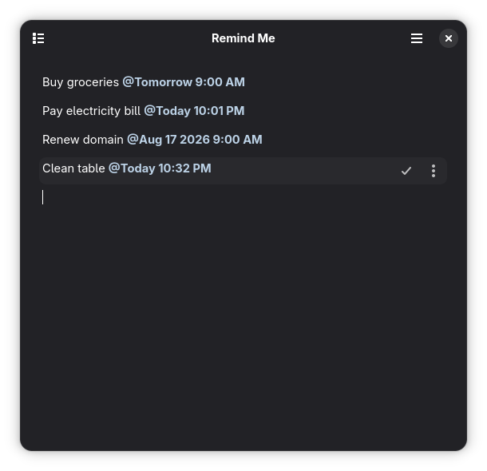

<p align="center">
  
</p>

<h1 align="center">Cue</h1>

<p align="center">
  <strong>A fast, compact, focused scratchpad for things you can’t act on right now. built for GNOME.</strong>
</p>

<p align="center">
  
</p>

Cue is a canvas-first place for thoughts that should come back to you. Write
without creating a file or filling out a form, then add a `@schedule`
when a note should become a desktop reminder.

Everything stays local. Cue is built natively with Rust, GTK4, and libadwaita,
and follows your GNOME light, dark, accent, and high-contrast preferences.

## Install

Cue 0.2.0 is available as a standalone Flatpak bundle for `x86_64` systems.
Download `Cue-0.2.0-x86_64.flatpak` from the
[latest GitHub release](https://github.com/wuzi/cue/releases/latest), then run:

```sh
flatpak install --user ./Cue-0.2.0-x86_64.flatpak
flatpak run io.github.wuzi.Cue
```

The release also includes a SHA-256 checksum file. This standalone bundle does
not configure automatic updates; download and install future releases manually.

## Why Cue?

- **Start typing:** The whole window is your canvas. No titles, folders, or save
  button.
- **Schedule in context:** Write `Call Ada @tomorrow 9am` instead of opening a
  separate reminder form.
- **Stay oriented:** Reminders remain inline, while Active Reminders and History
  provide structured views when you need them.
- **Keep it private:** Notes, reminders, and completed history live in a local
  SQLite database. Cue has no accounts, analytics, or network access.
- **Act from the notification:** Mark a reminder Done or snooze it for ten
  minutes without reopening the app.

## Reminder syntax

Write a note, then add an optional schedule after `@` to make it a reminder:

```text
Take a break @in 30 minutes
Call Ada @tomorrow at 9am
Submit the report @next Friday 14:30
```

Supported forms include relative times, named days, weekdays, day parts, and
calendar dates:

- `in 15 minutes`, `in an hour`, `in 2 days`, `in 1 week`
- `today`, `tomorrow`, `Friday`, `next Friday`
- `9am`, `9:30 PM`, `14:30`, `noon`, `midnight`
- `morning`, `afternoon`, `evening`, `tonight`
- `Aug 20`, `August 20 2026`, `2026-08-20`

## Native development

Install Rust, Meson, Blueprint Compiler, GTK4, and libadwaita development
packages, then run:

```sh
meson setup build
meson compile -C build
./build/cue
```

`cargo run` and `./build/cue` are useful for interface and storage development,
but they do not install the desktop metadata GNOME requires for notifications.
Cue warns about this instead of marking an undeliverable reminder as delivered.

For end-to-end native notification testing, install the development build for
your user and launch the installed application:

```sh
meson setup --reconfigure build --prefix="$HOME/.local"
meson compile -C build
meson install -C build
"$HOME/.local/bin/cue"
```

On Fedora, the required packages are `rust`, `cargo`, `meson`,
`blueprint-compiler`, `gtk4-devel`, `libadwaita-devel`, `gettext-devel`, and
`sqlite-devel`.

## Flatpak

Install Flatpak Builder and the GNOME 50 SDK, then run:

```sh
flatpak-builder --user --install --force-clean flatpak-build io.github.wuzi.Cue.json
flatpak run io.github.wuzi.Cue
```

Closing the window keeps Cue running while reminders are pending in the current
login session. Delivery after logout, reboot, or forced termination is outside
the first release; overdue reminders are delivered when the app next starts.
